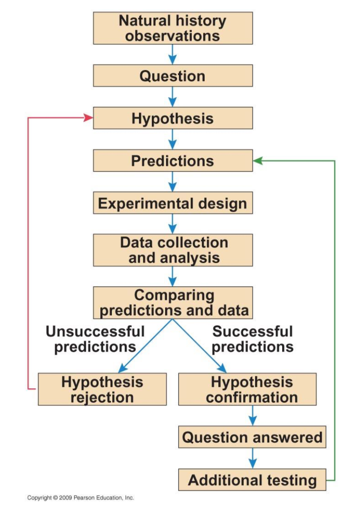

# Ecology and Evolution

## Intro to Ecology and Evolution

Lecturer: Professor Neil Price
Lecturer Contact Info: neil.price@mcgill.ca
Lecture Room: STBIO N6/12

### What is Ecology and Evolution?
#### Definitions

> Study relationships between organisms and their environment.

#### Tries to answer these question:

> How did this diversity originate?

> How is it maintained?

> What are its consequences?

#### Scientific Method

