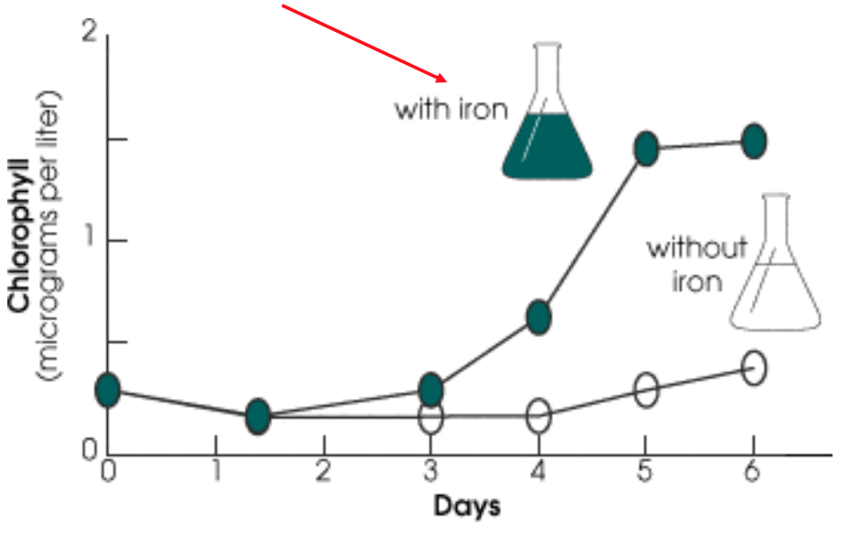

# Ecology and Evolution

## Intro to Ecology and Evolution

Lecturer: Professor Neil Price
Lecturer Contact Info: neil.price@mcgill.ca
Lecture Room: STBIO N6/12

### What is Ecology and Evolution?
#### Definitions

> Study relationships between organisms and their environment.

> They are intimately linked

#### Tries to answer these question:

> How did this diversity originate?

> How is it maintained?

> What are its consequences?

#### Scientific Method

Ecology and Evolution both use the scientific method. (see below)

#### People Studying Ecology and Evolution

..* Ecologist
> Describe and try to understand the distrubution and abundance (and production) of organism in their environment.

..* Evolutionary Biologist
> Describe reconstruct and try to understand changes in characteristic of living organism through time.

..* Ecologist and Evolutionary Biologist
> Study Ecology and Evolution at different scale.

#### Ways to Study Evolution

  * Fossil (molecular) records
  * Evolution in real time (experimental evolution)
  * Evo-Devo is the study of genes important in evolution

### Price Research Program (a.k.a. Fe-Enrichment Experiment)
__Goal__: Observe effect of resource regularization of phytoplankton growth.
__Location__ : Antartica.
__Methodology__: 
1. Collection of clean water sample.
2. Add Iron sample to some sample and leave the rest untouched.
3. Observe results.

__Results__:
Correlation between Iron in water and particulate organic matter in water.

__Notes__: The true test of the Iron hypothesis is a large-scale open-ocean experiemnts.

