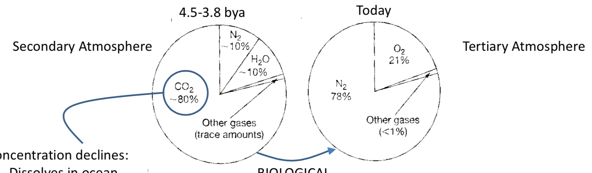
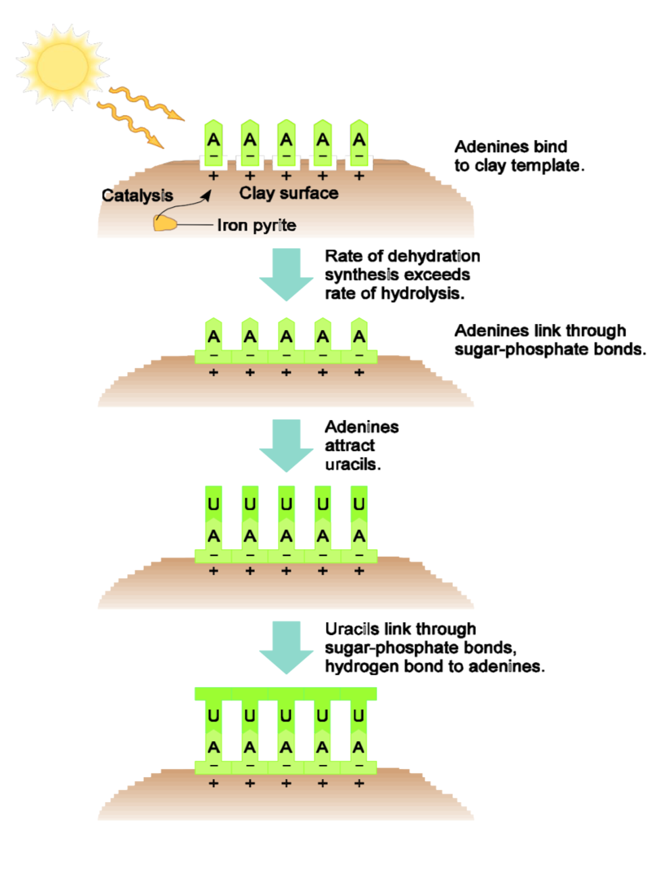
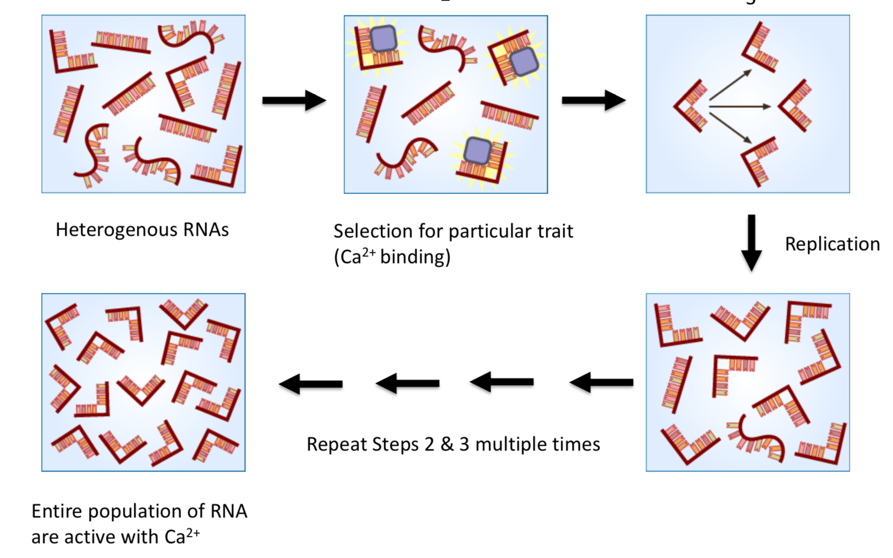

# Ecology and Evolution

## The origin of Earth and Life
Lecturer: 
Lecturer Contact Info: 
Lecture Room: STBIO N6/12

### Origin of Elements and Earth

#### Chronological HIstory of Earth
| Time                        |      Era       |
|-----------------------------|---------------:| 
|__4.6 b.y.a.__               | Origin of Earth|
|__4.5 b.y.a. to 1.5 b.y.a.__ | Archean        |
|__1.5 b.y.a. to 0.5 b.y.a.__ | Proterozoic    |
|__0.5 b.y.a. to 250 m.y.a.__ | Paleozoic      |
|__250 m.y.a. to 65 m.y.a.__  | Mesozoic       |
|__65 m.y.a. to Now__         | Ceonozoic      |

#### Big Bang Theory
  * Between 10 and 15 Billion years ago.
  * 1H and 4He are created.
  * Formation of photostars
  * Photostars burn and create heavier elements (up to 26Fe
  * Photostar explodes as supernova and create our system solar around 4.6 b.y.a.

#### Earth's Formation
  * Initially composed of Fe, Mg, Si and O
  * Oldest rocks are 4.28 b.y.a.
  * Earth cools down and crust form around 4.2-4.1 b.y.a.
  
#### How do we Know These Dates?
  * By analysing minerals in rocks
  * When knowing the halflives of an element, we can calculate when it was formed in the sediments
    

### Primitive Earth's Atmosphere and Ocean

#### Atmosphere
  * Earth's first atmosphere was made of H2 and He
  * Between 4.5 and 3.8 b.y.a. many meteors crash on the planet bringning frozen gases
  * Volcanic activities generated more gases on earth (80% vs 20% for meteors)
  * CO2</
    sub> at high level (100 to 1000 times more than today)
  * N2 and H2O plus traces of H2, S, amonia and methane.

__note__: No free O2, great because it could've prevent the build-up of organic molecule
  
  * Atmospheric composition changes:
  

#### Oceans
  
  * Earth was too hot for liquid water, so it stayed in the atmosphere
  * When Earth temperature became lass than 100 Celcius, water condensated
  * Liquid water was around by 3.9 b.y.
  * Gases started to adilute into water, causing the water to become acid
  * Acid water dissolved rocks into the water by process named "chemical wathering"
  

### Origin of Building Blocks

#### Biomarkers

Biomarkers are marker in time proving evidence of life (?)

__Example of Biomarkers:__

  * Molecules
  * Organic C deposit
  * Chemical changes that indicate biological reaction

#### Origin of Life

##### Original Hypothesys

  * Most research of early life formation does not study fossils but consist of in lab experimentation. 
  * We try to reproduce reactions that happend 4 b.y.a. using the raw material and replicating the environment.
  * Organic compounds or rich in element C (C-C bond)
  
###### Miller-Urey Experiment (1953)

  * Use gases present in early earth atmosphere 
  * __Results:__ 
      1. Within a week, 17 to 20 different amino acid where formed.
      2. All purine and pyrimidines (RNA and DNA)

##### Second Hypothesys (a.k.a Panspermia)

Life could come from outer space. 3 proofs:

1. Murchison Meteor has plenty of C-compound
2. ALH84001 Meteor has contained some evidence of microorganism (refuted by some scientist)
3. Variety of organic molecule was found in outer space (e.g. Methane, Methanol, Formaldehyde, Cyanoacetylene)

#### A Paradox

__Problem:__ Protein is a catalyst for DNA creation. But Protein requires DNA's nucleo acids to be formed. Which one came first (egg-chicken problem)?

__Solution:__ Before life, RNA had capabilities to self-replicate and catalize chemical reaction.

### RNA World

#### Origin of RNA polymers

__Hypotheses #1:__ RNAs formed in a pond. This does not hold because they would of been diluted (hydrolisys > polymerization)

__Hypotheses #2:__ Clay catalized the formation of RNA. This proposes lots of copies and replication and thus, random mutation. The mutation caused the increase in production.

####  Ribozime

  * Discovered Thomas Cech and Sidney Altman (Nobel prize)
  * Ribozime are RNA molecules with enzymatic properties 
  * There are ribozyme molecules with and without protein
  * They store information and act as catalysts, which is required for life formation
  * Experiment of evolution of RNA in lab has been conducted. Here a image:
  

#### From RNA to DNA and Proteins

  * RNA started to create proteins with catalytic properties
  * One of these enzyme could've been the reverse transcriptese thus translating RNA to DNA
  * DNA is better suited to store information (chemically more stable)

DNA --> RNA --> Protein
The sequence is established

### First Organisms

Formation of life could not of been possible without "compartmentalization". Its the creation of the outer membrane that enclose the nucleic acids. 

Life probably came from the deep ocean near hydrothermal vents. We believe this because:
1. Precense of clay
2. Presence of metal catalysts
3. No UV (killing the organisms)

#### Theory About Life Begening

1. Prebiotic chemical react to form an organic molecule in watery environment ("soup")
2. Polymerization and dehydratation from nucleic acid and proteins. Creation of reverse-transcriptese (RT)
3. RT translate RND to DNA which replicates itself
4a. DNA replicated
4b. RNA from DNA builds protein sphere for compartmentalization
5. This results in a _self-replicating system enclosed in a permeable protective lipid sphere_

