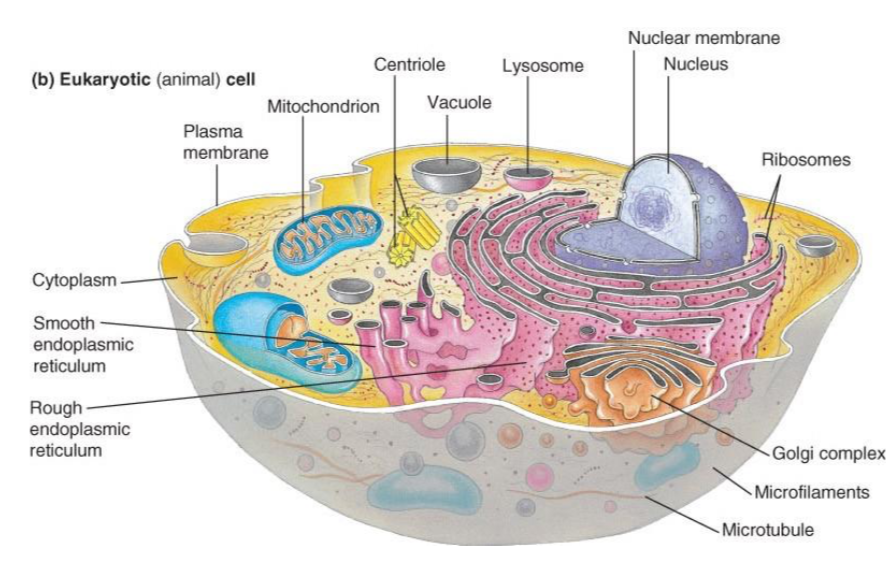
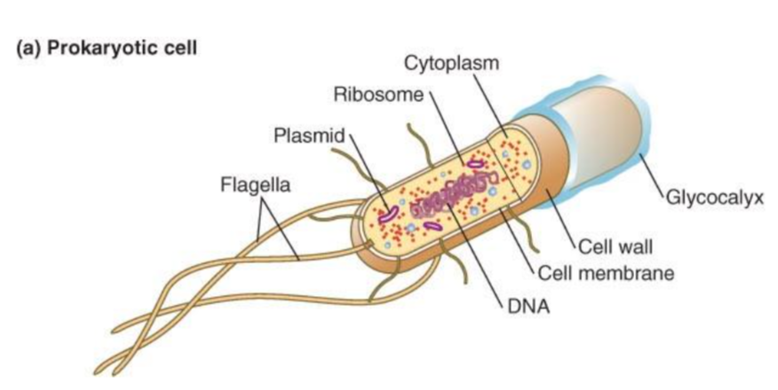

# Ecology and Evolution

## The Nature of Early Life
Lecturer: 
Lecturer Contact Info: 
Lecture Room: STBIO N6/12

### Requirements of Life

> There are 3 things required for life: Energy, Liqui water and Elements that constitute essential biomolecules.

#### Energy

  * Used to assemble elements into complex molecules
  * Used for replication
  * Used for modality and acquire other resources
  
> Main sources of energy are: (1) Light (photosynthesis), (2) Organic molecules and (3) Inorganic Molecules (chemosynthesis)

##### Trophic Classification of Organisms

Organisms can be classified by how the get their energy.

###### __1. Autotrophs (self-feeders):__

      1.1 Photosynthetic
          * From light (PAR 400-700nm)
      
      1.2 Chemoautotroph
          * From inorganic molecues by chemical bond energy
          * e.g. H2, H2S, NH2+, Fe(II), etc
      
###### __2. Heterotrophs (other-feeders):__
  
      * Organic molecules for energy and C (Carbohydrates, proteins, fats)
      * e.g. Herbivores, Carnivores, Omnivores, Detritivores, Saprovores
  
##### Why is Energy so Important?

  * An organism has a maximum rate at which it can intake energy
  * Limitations can be shortage due to environment, less food, bad quality
  * Internal limitations can be required use of energy (e.g. disgestion and enzyme catalysis)
  * Since its a limited resource, an organism cannot simultaneously maximize all of life's functions

#### Water

  * Organism mass is between 50% to 90% Water
  * ALl chemical reactions required for life happends in water
  * H-bonding makes water a universal solvant
  
#### Elements
  
  * Examples of important elements: N, P, S, Fe, Cu
  * Used to construct cellular constituents
  * Used in biochemical reactions required for survival
  * Organism require 28 elements
  * The 6 most common elements are C, H , O, P, N, S
  * Organism get element from their environment
  * The essential element's concentration may vary with time and location
  
__Definition:__ An essential element is definied as an element required by an organism to complete its life cycle.

__Important Notes:__ 

1. There is a correlation between the element concentration in the *Environment* and the element concentration in the *tissue*.
2. Nutriment may be limiting to growth of organisms in nature
3. The availability affects an organism's ecology and evolution
  
#### Hypothesis on first organism

1. (favored hypothesis) Chemoautotroph (From inorganic sources)
2. Hetorotroph (From organic matter that was synthesized abiotically)

__Other Charactheristics of First Organism:__
  
  * Anaerobic
  * Hyperthermophilic ad halophilic
  * Prokaryotic (single cell organism, without distinct neucleus with membrane)
  
__Note:__ The first organisms may have been similar to Methanococcus (Type of coccoid, spherical bacterium)

#### Evidence for Early Chemoautotrophy

  * All extant living organism near the origin of the phylogenetic tree are found in hot springs and hydrothermal enviroments (100 Celcius).
  * These environment are likely to look like earth's early stage
  * These organisms uses H2 as energy source
  

### Photosynthesis

  * Some organisms started to have pigments that made light capturing possible
  * Earliest form of photosynthesis was sulfur based (not with oxygen: anoxygenic)
  * Around 3.5 to 2.7 b.y.a. oxygen based photosynthesis appeard
  * H2O was inexhaustible
  * O2 started to accumulate

### Oxygen Accumulation

  * The Oxygen accumulatio cause a new type of metabolism to appear: _aerobic_
  * An aerobic metabolism can yield more energy per mol of C substarte consumed
  * The accumulation changed the oceans chemistry (S and N oxidation)
  * The accumulation of O cause the environment to be poisoned

> __Important Note:__ The release of O2 by photosynthesis is perhaps the single most significant effect of life on the geochemistry of the earth.

### Origin of Eucaryotes

  * Eukaryotes appear 1.8 b.y.a.
  * Before Eukaryotes it was only Bacteria and Archaea
  * Analyse the differences between an Eukaryotic (animal) cell (A) and a Prokaryotic cell (B)
  
| (A) | (B) |
|-----|-----|
| | |

#### Endosymbiotic (a.k.a. Theory of Origin of Eucaryotes)

1. First theory; Proposed by Lynn Margulis
  * Mitochondria and chloroplasts of eucaryotes were engulfed by and Archaea and evolved in obligatory symbiosis

2. Second theory; The Nucleomorph
  * A remnant of the nucleus of the endosymbiont in the chloroplast

