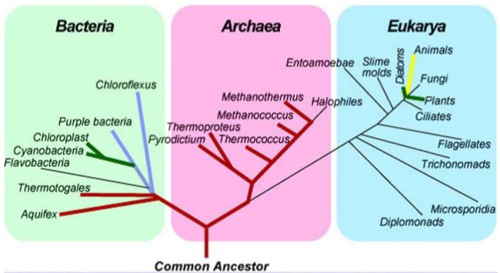
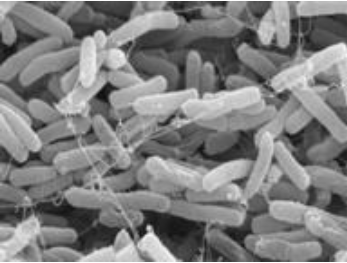
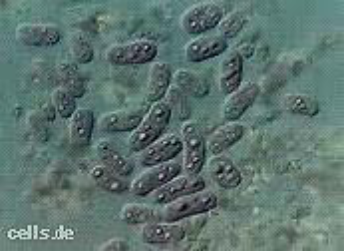

# Ecology and Evolution

## Biodeversity I
Lecturer: 
Lecturer Contact Info: 
Lecture Room: STBIO N6/12

### Classification

#### What is classification?

  > Method for organizing information. We group similar organism together. Hitorically, phisical characteristics were used to make those categories.
  
  > Ideally, the categorization should reflect the evolutionary distances and relationships amoung organisms. It should even be able to predict future characteristics and understand the history of life.

#### Difficulty of Classifying Microorganisms

  > It is often hard to classify organism because they are slowly evolving. The transmission of genetic information captures ancestral relationships.
  
  > Morphologically simple organisms do not have obvious features to measure relatedness of species.
  
  
### Ancestral Organism and the Universal Tree of Life (a.k.a. UToL)

#### Last Universal Common Ancestor (LUCA)

  > All organisms diverged from a common ancestor.

  > They all share: genetic code, mode of DNA replication, protein-synthesizing system, metabolic pathways, lipid bilayer and active transport.

#### Molecular Phylogeny (a.k.a. Molecula Ancestry)

  > RNA gene sequence identifies 3 major lineages: 
      * Bacteria (prokaryote)
      * Archaea (prokaryote)
      * Eucarya (eukaryote)

  > See the image for visual support

### Horizontal Gene Transfer (a.k.a. HGT)

  > During endosymbiosis, genes were transferred from the endosymbiont to the host genome (EGT).
  
  > HGT is affected by plamid. Plasmids are small circular DNA particle that contains foreign genes that can be transferred.
  
  > __Facts:__ 20% of the E. Coli genome is traced to HGT
  
#### 1. Archaea

  > There are 3 majors groups: Euryarchaeota, Crenarchaeota, Korarchaeota.
  
##### Euryarchaeota

  > Contains methanogens and halophils. The methanogens release methane (CH4). The Halophils grown in salt water (up to 23% NaCl)
  
  > They inhabit extreme environments (e.g. hot springs and hydrethermal vents)

#### 2. Bacteria

  > They are divided into 12 mjor lineage according to rRNA gene sequence. The most anciant bacteria are hyperthermophilic chemoautotriphs which uses H2 or reduced S as energy source. 

##### 2.1 Proteobacteria

  > This is the largest group of bacteria. It includes hererotriphic and phototrophic genera. It includes purple and green sulfur bacteria.
  
  > The photosynthesis is anoxygenic and thus uses H2S instead of water as electron donor (S and not O).
  
  > Ususally uses light or inorganic coumpounds or organics.
  
  > Here is an (A) E. coli and (B) Purple Photosynthetic Bacterium
  
  | (A) | (B) |
|-----|-----|
| | |

##### 2.2 Cyanobacteria

  > It is a large group of phototrophic that uses oxygenic photosynthesis and generate dioxide.
  
  > It is amoung the most important primary producers in lake and oceans

#### 3. Eucarya

