# Ecology and Evolution

## Biodeversity I

### Classification

#### What is classification?

  > Method for organizing information. We group similar organism together. Hitorically, phisical characteristics were used to make those categories.
  
  > Ideally, the categorization should reflect the evolutionary distances and relationships amoung organisms. It should even be able to predict future characteristics and understand the history of life.

#### Difficulty of Classifying Microorganisms

  > It is often hard to classify organism because they are slowly evolving. The transmission of genetic information captures ancestral relationships.
  
  > Morphologically simple organisms do not have obvious features to measure relatedness of species.
  
  
### Ancestral Organism and the Universal Tree of Life (a.k.a. UToL)

#### Last Universal Common Ancestor (LUCA)

  > All organisms diverged from a common ancestor.

  > They all share: genetic code, mode of DNA replication, protein-synthesizing system, metabolic pathways, lipid bilayer and active transport.

#### Molecular Phylogeny (a.k.a. Molecula Ancestry)

  > RNA gene sequence identifies 3 major lineages: 
      * Bacteria (prokaryote)
      * Archaea (prokaryote)
      * Eucarya (eukaryote)

  > See the image for visual support

### Horizontal Gene Transfer (a.k.a. HGT)

  > During endosymbiosis, genes were transferred from the endosymbiont to the host genome (EGT).
  
  > HGT is affected by plamid. Plasmids are small circular DNA particle that contains foreign genes that can be transferred.
  
  > __Facts:__ 20% of the E. Coli genome is traced to HGT
  
#### 1. Archaea

  > There are 3 majors groups: Euryarchaeota, Crenarchaeota, Korarchaeota.
  
##### Euryarchaeota

  > Contains methanogens and halophils. The methanogens release methane (CH4). The Halophils grown in salt water (up to 23% NaCl)
  
  > They inhabit extreme environments (e.g. hot springs and hydrethermal vents)

#### 2. Bacteria

  > They are divided into 12 mjor lineage according to rRNA gene sequence. The most anciant bacteria are hyperthermophilic chemoautotriphs which uses H2 or reduced S as energy source. 

##### 2.1 Proteobacteria

  > This is the largest group of bacteria. It includes hererotriphic and phototrophic genera. It includes purple and green sulfur bacteria.
  
  > The photosynthesis is anoxygenic and thus uses H2S instead of water as electron donor (S and not O).
  
  > Ususally uses light or inorganic coumpounds or organics.
  
  > Here is an (A) E. coli and (B) Purple Photosynthetic Bacterium
  
| (A) | (B) |
|-----|-----|
| | |

##### 2.2 Cyanobacteria

  > It is a large group of phototrophic that uses oxygenic photosynthesis and generate dioxide.
  
  > It is amoung the most important primary producers in lake and oceans
  
  > Here are examples of Cyanobacteria
  
| (A) | (B) |
|-----|-----|
|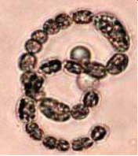 | 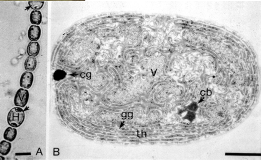|

#### 3. Eucarya

  > Originated 2.7 to .8 b.y.a.
  
  > Historically, there were 4 Kindoms: Plants, Animals, Fungis and Protists. 
  
  > Now we divide them in 5 groups: (1) Excavates, (2) Chromalveolates, (3) Rhizaria, (4) Archeplastida (a.k.a. Plantae) and (5) Unikonts
  
##### Excavates

  > They do not have a single morphological feature common to all. It is a diverse group.
  
  > They are parasitic organism and includes flagellated and obligate anaerobes
  
  > An example of excavates are _Trichonympha_. It inhabits ternite guts.
  
  
  
  > Another example of excavates are _Trypanosoma_. They are a causative agent of sleeping sickness. Here are some images:
  
  | (A) | (B) |
  |-----|-----|
  |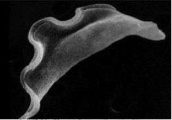 | |

##### Chromalveolates

  > This is a super group that contains 23 previous groups. For example Algae and some non-photosynthetic groups.
  
  > They are primary producers and consumers of planktonic communities of lakes and oceans.
  
  > An example of this are Avelolates. One kind of Avelolates are Dinoflagellates. It is a heterotrophic and phototrophic species. Some species are symbionts of invertebrates (corals). The Dinoflagelates may cause the tide (water) to have a red tone. Another example of Avelolates are Apicomplexa. They are obligate parasites of animals (e.g. malaria). Here are images of a (A) Dinoflagellates and an (B) Apicomplexa:
  
  | (A) | (B) |
  |-----|-----|
  |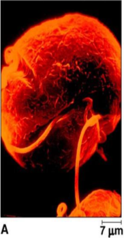 | 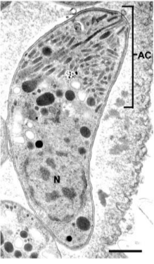|
  
  > Another example are the Stramenophiles. An example of Stramenophiles are Diatoms. There are 10'000 species found in diverse aquatic environments.  THhey are responsible for 25% of global primary production. They have a silica (glass) exoskeleton (a.k.a. frustule). Only the males have flagellum. Here are some images:
  
  | (A) | (B) | (C) |
  |-----|-----|-----|
  |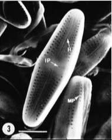 | 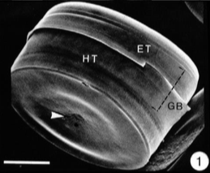|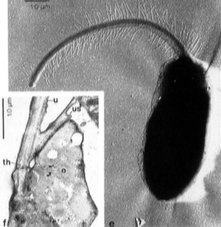 |
  
  > Another example of Stramenophiles are Oomycetes. They are water molds. They have filaments and produce flagellated zoospores. They cause many agrecultural diseases. Here's a photo of and Oomycetes:
  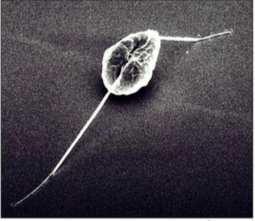 
  
##### Rhizaria

  > They are group together because of their molecular data. They do not share any morphological features.
  
  > They have heterotriphic cells that consume prokaryotes and eucaryotes.
  
  > Many Rhizaria produces pseudopodia used in feeding.
  
  > They are mostly found in water near Mexico, the mediterania, the indian ocean and then the pacific ocean. Rare in the extreme north and extreme parts of the oceans.

##### Plantae (a.k.a. Archeplastida)

  > They include red and green algae, land plants and Charophytes.
  
  > They all contain plastids that arose by primary endosymbiosis.
  
  > The sexual reproduction is common. It can be either isogamy (egual sized gametes) or oogamy (large egg and small sperm). 
  
  > They can be unicellular, colonial or multicellular.
  
  > The Chlorophyta is an example of Plantae. _Chara_ is a distinct genus of Chlorophyta that has distinct reproductive stuctures that contain eggs (oocyte). Some Chlorophyta have advanced reproductive features. Here are images of Chlorophyta:
  
  | (A) | (B) |
  |-----|-----|
  |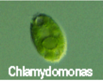 | 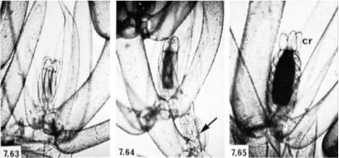|
  
  
##### Unikonts

  > They include parasitic protists, slime molds, amoebae, animals and also fungi. They also include _choanoflagellates_ that ressemble to sponges.
  
  > They appeared 600 m.y.a. after the drastic raise in O"2 in the atmosphere.
