# Radiations

>  __Adaptive Radiation:__ Evolutionary divergence of members of a single phylogenetic lineage into a variety of different adaptive forms over a relatively short interval of geological time.

## Advantages of Multicellularity

## Cambrian Radiation in Detail

| Eon | Era | Period | Epoch | Milions of Years Before Present | Duration in Millions of Years | Major Organic Events |
|:----|:----|:-------|:------|:-------------------------------:|:-----------------------------:|:---------------------|
| Phanerozoic | Paleozoic | Silurian | n/a | 417 to 443 | 26 | First land plants. First land invertebrate. |
| Phanerozoic | Paleozoic | Devonian | n/a | 334 to 417 | 63 | Rise of fishes. First land vertebrate. |
| Phanerozoic | Paleozoic | Carboniferous | Mississippian | 320 to 354 | 34 | Development of amphibians and insects. |
| Phanerozoic | Paleozoic | Carboniferous | Pennsylvanian | 290 to 320 | 30 | Appearance of early reptiles. |
| Phanerozoic | Mesozoic | Jurassic | n/a | 142 to 2016 | 64 | Rise of giant dinosaurs. Appearance of birds. |
| Phanerozoic | Mesozoic | Cretaceous | n/a | 65 to 142 | 77 | Extinction of dinosaurs. First flowering plants. |
| Phanerozoic | Cenozoic | Tertiary | Paleocene | 55 to 65 | 10 | Radiation of primitive mammals. |

## Radiations of the History of Life

  > Radiation is appends because organism try to fill previously unavailable niches. It is a competitive advantage and release the specie from some competition.
  
  
### The Ediacaran Biota

  > The Ediacaran Biota is a diverse and enigmatic assemble of organisms. __They are not animals.__
  
  > They have no basic animal anatomical features. For instance, they have no eyes, no mouths, no anuses, no intestinal tracts nor locomotory appendages.
  
  > They are considered as an alternative early evolutionary experiment in multicellularity.

  > Here's an example of Ediacarans:  
  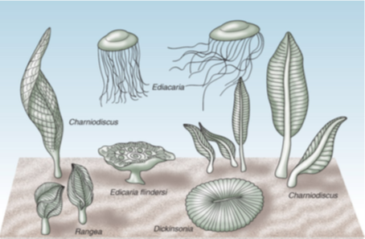
  
Here are some Ediacarans:

|     Name    | Image | Notes |
|:------------|-------|:------|
| Dickinsonia | 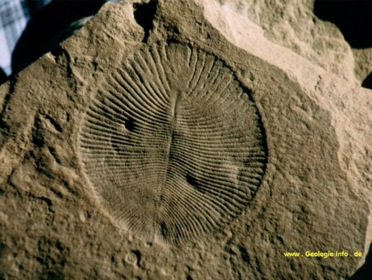 | 1m of diameter and 3mm thick. |
| Spriggina | 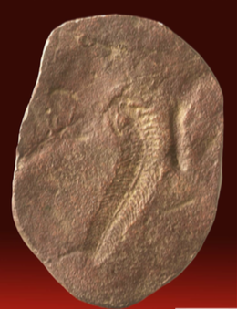 | The relationship with living animal is unclear. |

### The Burgess Shale Fauna

  > Found in the Yoho National Park in BC, Canada and 12 other sites worldwide.
  
  > The burges shale fauna are a group of organims that are crown taxa that already evelved the characters that define the phyla of living animals.
  
  > There are morphological gaps that separes these crown taxa.
  
  > Here and example of the Burgess Shale of British-Columbia:
  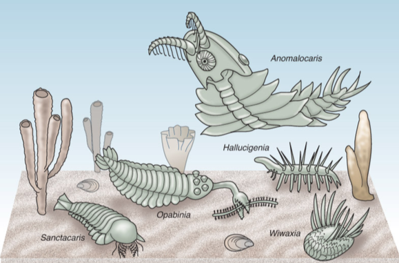
  
|     Name    | Fossil | Image | Notes |
|:------------|--------|-------|:------|
| Hallucigenia | 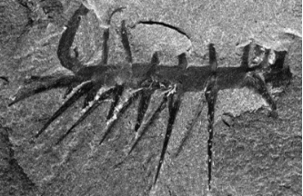 | 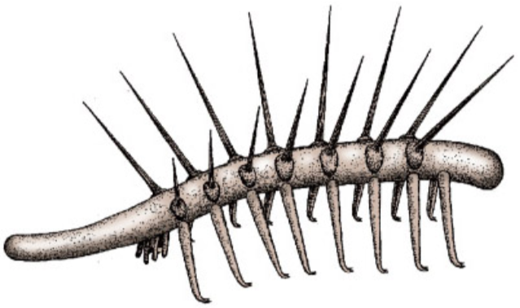 | Is could be an early Onichophoran. |
| Anomalocaris | 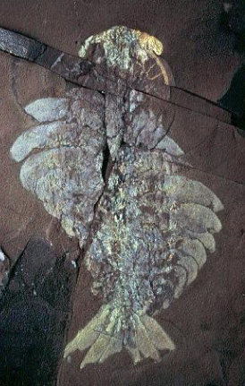 | 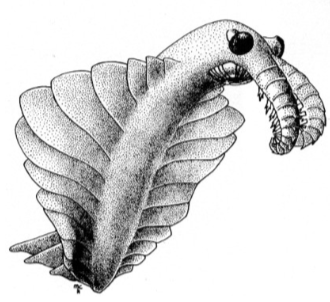 | It could be an early arthropod. |
| Opabinia | 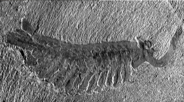 | 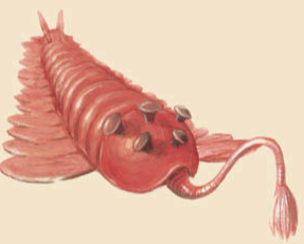 | It could be an early arthropod. |
| Wiwaxia | 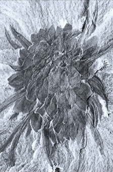 | 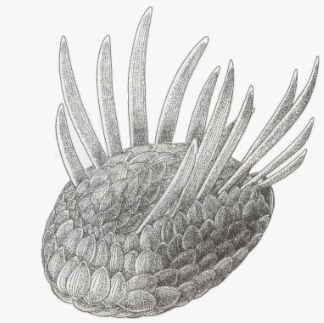 | It could be an polychaete worm. |
| Pikaia | 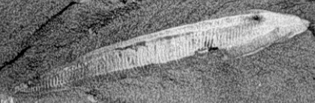 | 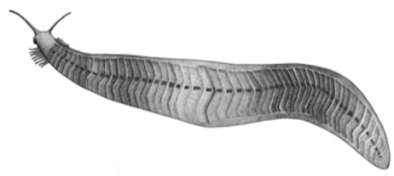 | It could be an early chordate. |

### Interpritation of the Ediacara and Burgess Shale Fauna

There are 2 controversies motivating Gould's and Conway Morris' theories:

  * Interpretation
  * Timing

#### Gould's Interpretation

  > Gould believe that Edicaran and the Burgess Shale fauna share a common ancestor with the modern animals. 
  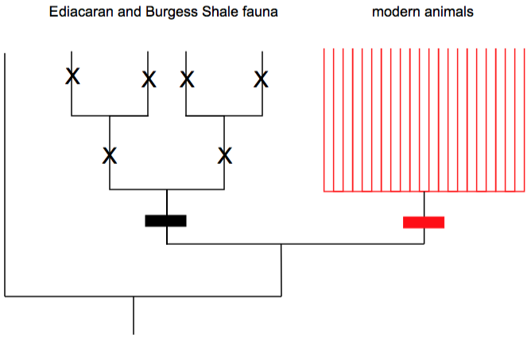
  
  
#### Conway Morris' Interpretation

  > Conway Morris believe that Edicaran and the Burgess Shale fauna are the ancestor of the modern animals. 
  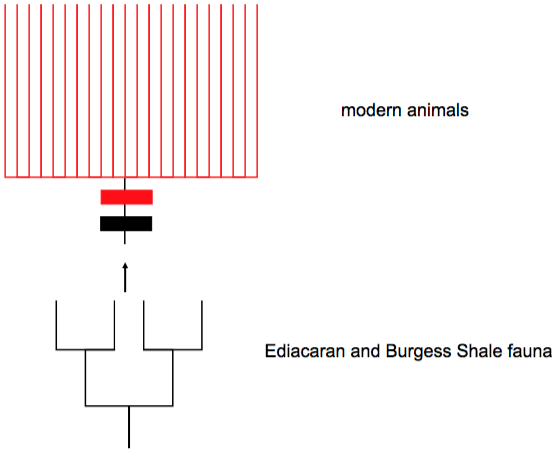

## Oberservation with Multicellularity

  > There is a correlation between the number of nucleotide substitutions and time. The further in the past we go, the more substitutions there are
  
  > There is a correlation between the number of amono acid different from the humain and the hemoglobin polypeptide and time. The larger difference is the further in time we go.
  
  > There is a correlation between the number of substitutions and the time between common ancestor. The older the common ancestor is the more substitution the is.
  
  
## Cause of Cambrian Explosion

  > Gene regulation is the central mechanism explaining the developmental and evolutionary changes.
  
  > Jacob reffers to evelotion as being a bricolage (tinkering). This term rightly places the emphasis on modification of exiting genes.
  
  > The global geological conditions were good.
  
  > Rising of oxigen levels.
  
  > Predator-prey relationships.
  
  > Developmental tool kit of genes.
  
  
## Highly Conserved Genes Accross all Animals

| Gene Conserved | Image | Notes |
|:---------------|-------|:------|
| __Engrailed__ | 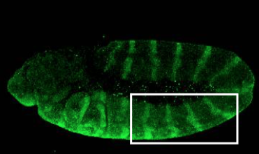 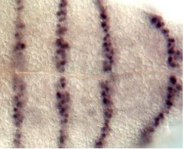 | N/A |
| __Pax6/eyeless__ | 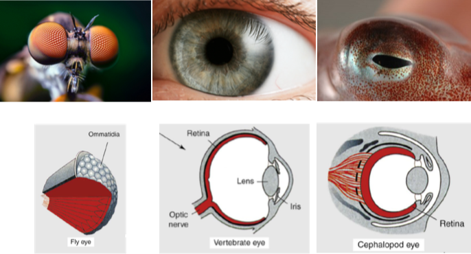 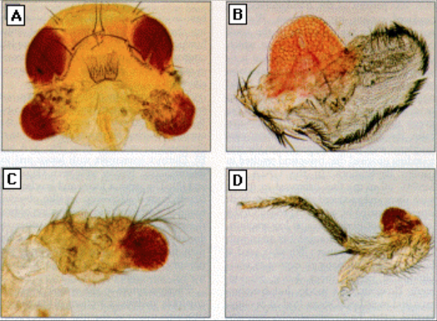 | The second image show that by adding the gene Pax6, we can grow eye anywhere on a body. |
| __Homeobox__ | 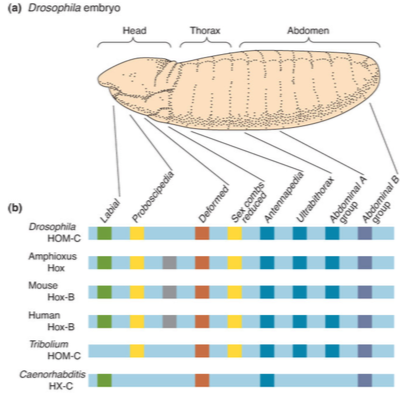 | Homeobox is a class of closely related sequence which occurs in various genes. |

