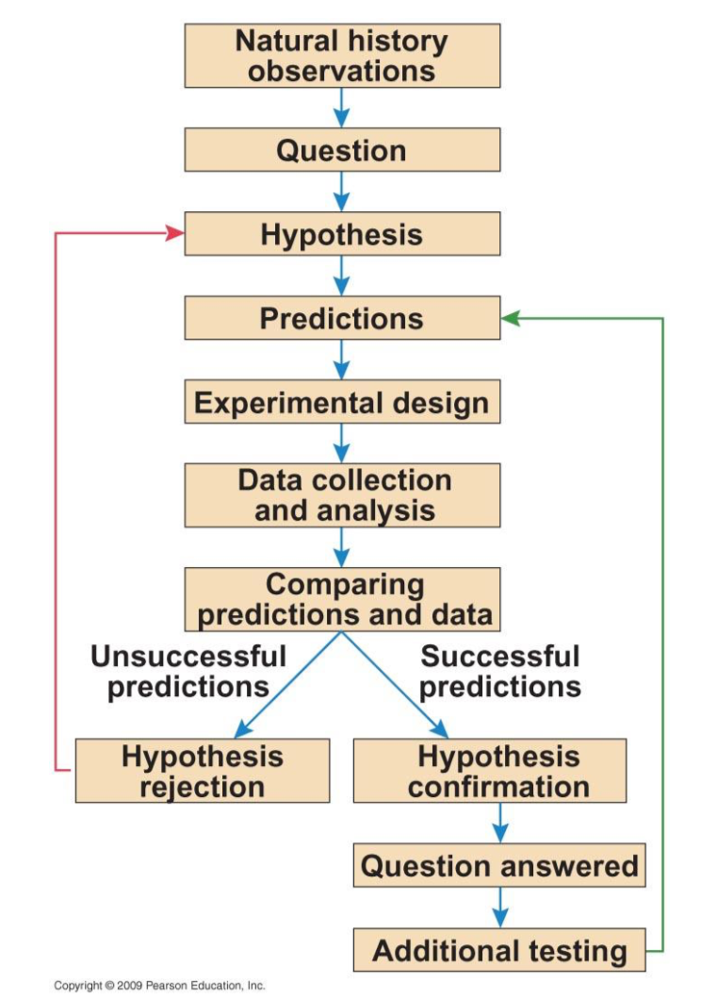
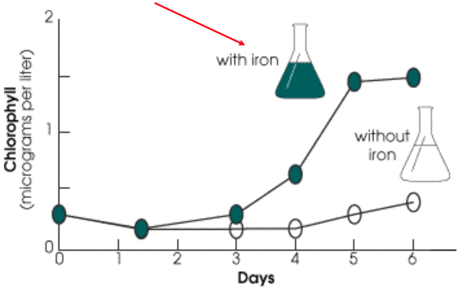

# Ecology and Evolution

## Lecture Topic
Lecturer: 
Lecturer Contact Info: 
Lecture Room: STBIO N6/12

### Topic 1
#### Sub_topic 1
  * Bullet 1
  
  * Bullet 2

#### Sub_topic 2
  * Bullet 1
  
  * Bullet 2

### Topic 2
__Goal__: Observe something

__Methodology__: 
1. Collection things.
2. Add blue to some sample and leave the rest untouched.
3. Observe results.

__Results__: Its blue!

