# Multicelluarity

## Principles in Evolutionay Biology

### Inferring Evolution History
  
  > It is the principle of phylogeny. It's the evolutionary development and diversification of a species or group of organisms, or of a particular feature of an organism.
  
  > Darwin's theory is based on inferring the origins of species.
  
  > This can be visualize with a tree (without roots) where the bottom is the common ancestor and the top are every single species existing. We call this a _Phylogenetic tree_. We call _internal nodes_ those that are not the end of a branch, and _terminal nodes_ if they are at the end of a branch. The _root node_ is the common ancestor. We call a branch an _internal branches_ if it is not linked to a _terminal node_ and _terminal branch_ if otherwise.
  
  > The number of rooted tree can be calculated in the following matter: `(2n-3)!/[2^(n-2)*(n-2)!]`
  
  > We can build such trees with DNA analysis and morphology analysis. There are 4 mothods to do so: Parsimony, Maximum likelihood, distance and bayesian methodology.
  
  > Here are images of Inferring Evolution History, a (A) Phylogenetic tree and a (B) DNA reconstruction

| (A) | (B) |
|-----|-----|
|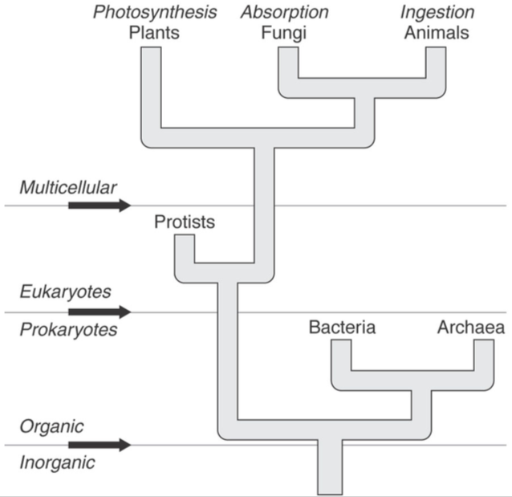 | 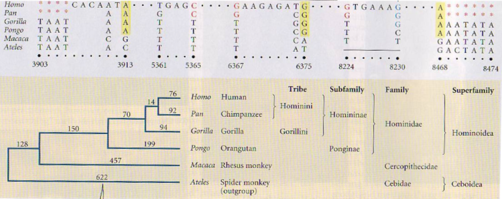|

  > The multicelluarity eveloved many times. There are general features of multicellular: Obligate (complex) multicellularity, Aggregative multicellularity and Clonal multicellularity
  
  
### Independent Evolution

  > It's the principle of convergence. Where 2 species share caracteristic but do not share near anestor.
  
  > We can observe this when 2 animals have similar morphological characteritics but are not the same species (e.g. bat vs owl, hippopotamus vs croccodile, etc)

### Direction in Evolution

  > The evolution of multucellularity is multidirectional. It has eveolved at least 16 times.

## Evolutionary Invention

### Animals

| Name | Image | More Info |
|------|-------|-----------|
| Sponges | 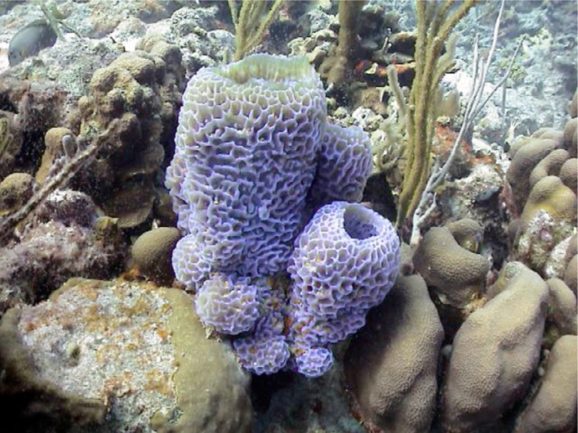| The evolution of multicellularity in animals remains a mystery. |
| Solitary Choanoflagellate | | They have flagella. They are heterotrophs. They draw in food through water currents. |
| Colonial Choanoflagellate | | They have flagella. They are heterotrophs. They draw in food through water currents. |
| Choanoflagellate Vs. Choanocyte | 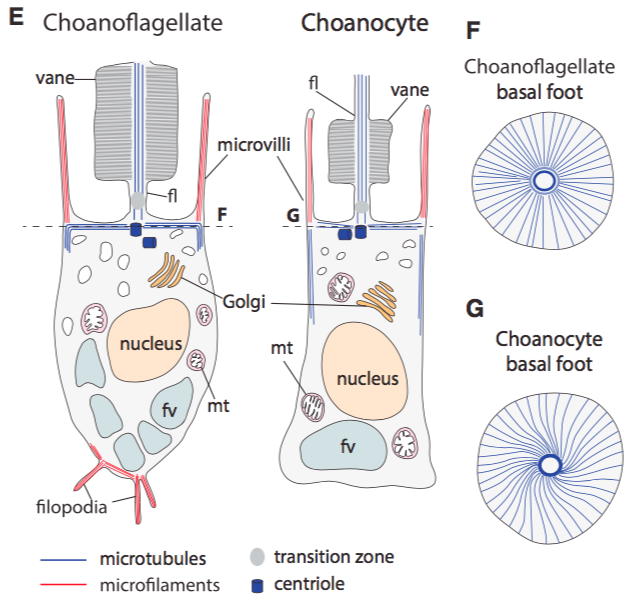| They have Tyrosine kinases (type of enzyme that can translate and group of phosphate to protein within a cell), Cadherins (type of cell adhesion), Integrins (adhesion of cells to each other and to their substrate), and extracellular matrix domains. |

### Fungi

| Name | Drawing | Image |
|------|---------|-------|
| Coprinus Mushroom | 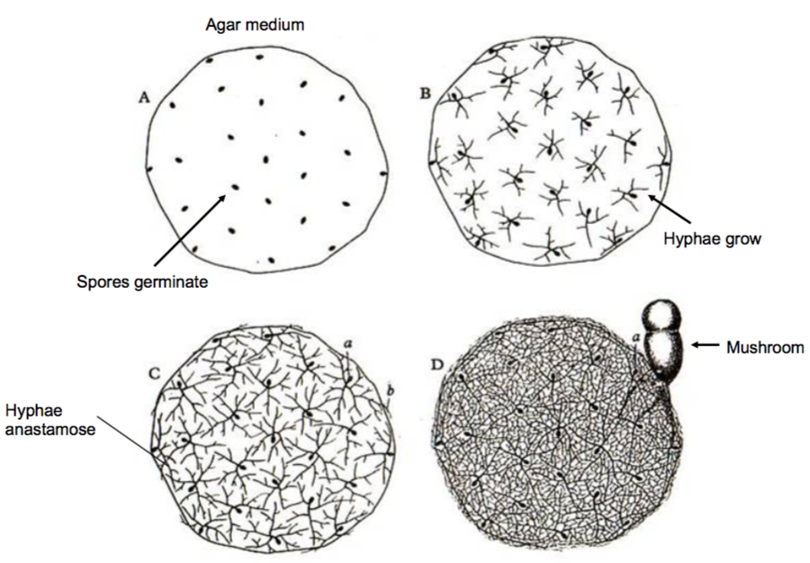| 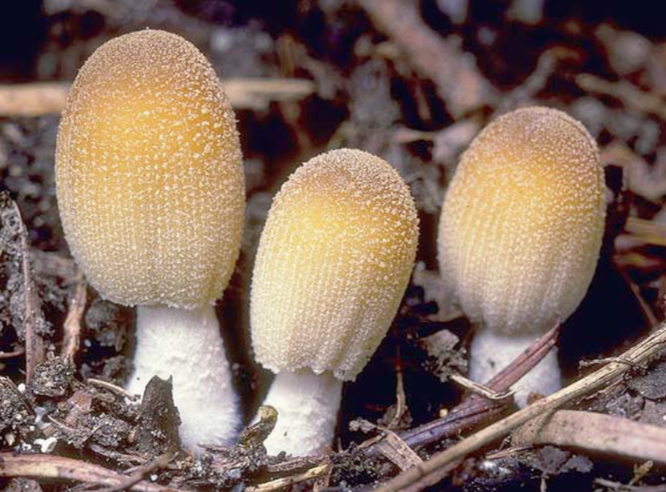|

### Red and Green Algae

| Name | Drawing | Image |
|------|---------|-------|
| Sea Lettuce Ulva | 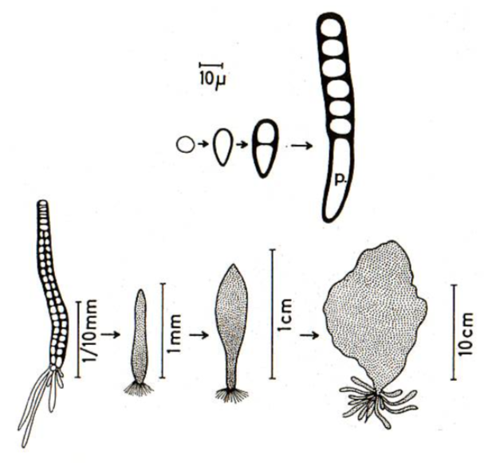| 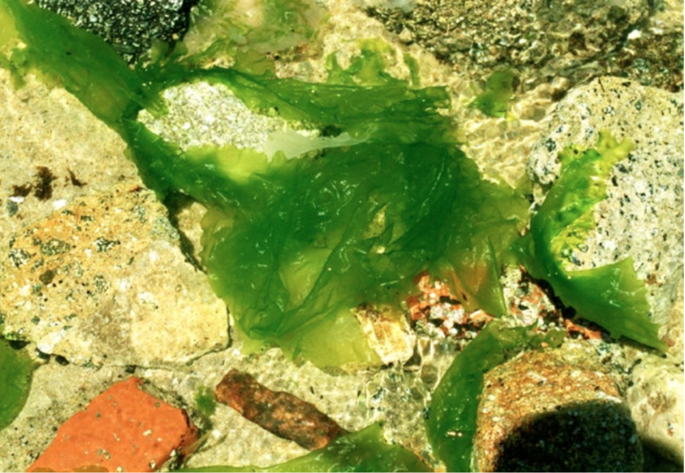|
| Green Alga - Volvox | 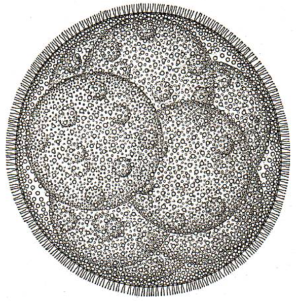| 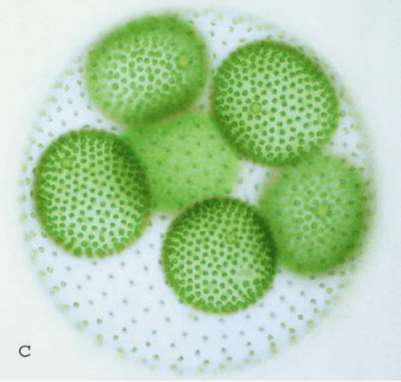|

### Diatoms

| Name | Drawing | Image |
|------|---------|-------|
| Colonial Diatom | 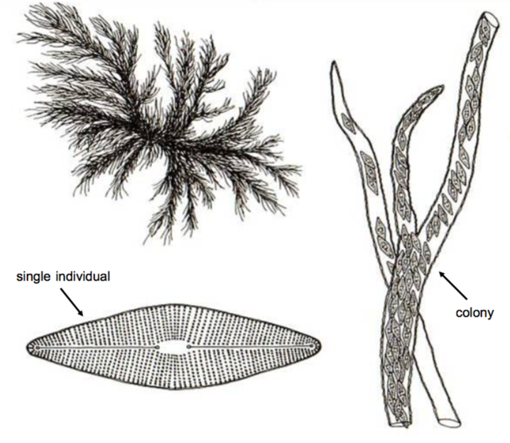| 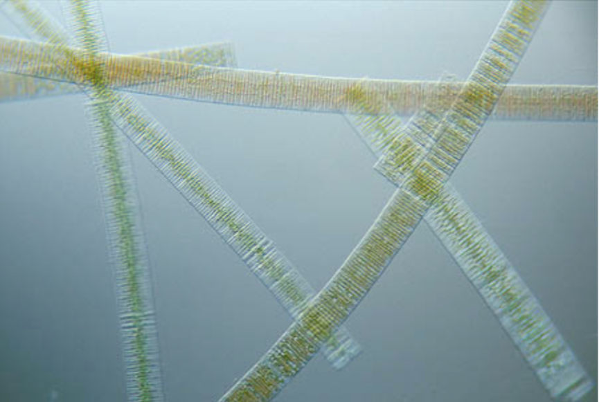|

### Ciliates

| Name | Drawing | Image |
|------|---------|-------|
| Ciliates | 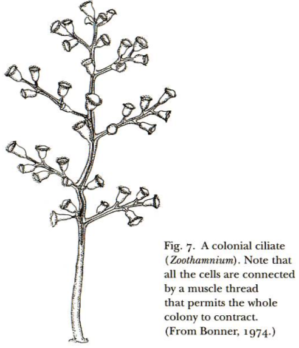| 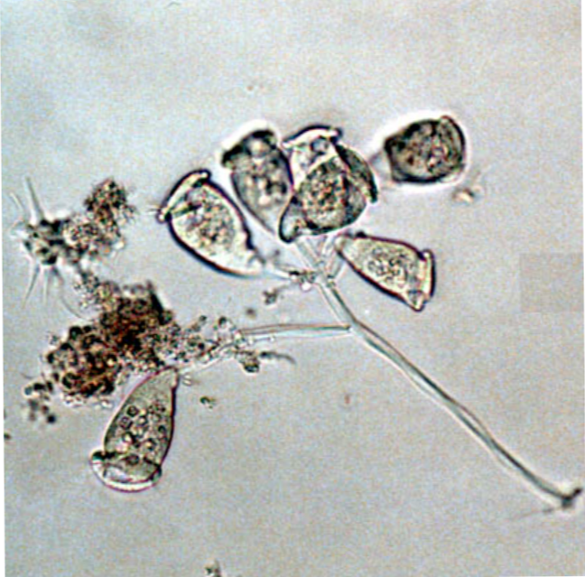|

### Cellular Slime Molds

| Name | Drawing | Image |
|------|---------|-------|
| Cellular Slime Molds | 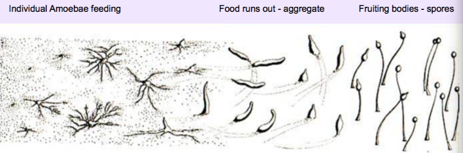| 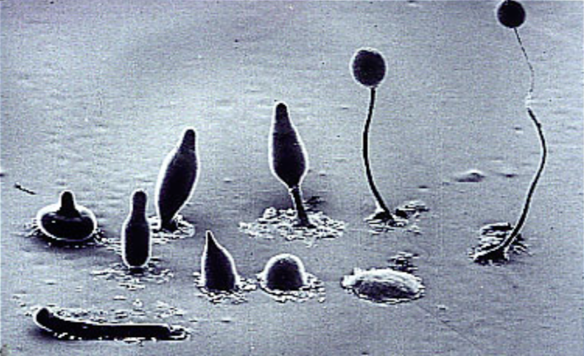|
