# Modern Diversity 2

## Some Facts

  > Between bacteria/archae, protist, fungi, plants and animals, the animals have the greatest number of species.
  
  > Between the mammals, the insects, the flatworms (platyhelminthes) and the mollusks (clams, snails) the insects have the greatest number of species (50%+).
  
  > Plants, animals and fungi are 3 kingdoms of the multicellular organisms.
  
  > Plants are known to evolve from organism similar to green algae. In fact, many plants reflect the transition from water to land.
  
  > Fungi are not simple plants, but a sister group of the animals.

## Animals
  
  > Hypotheized to evolve from the Choanoflagellates.
  
  > Animals obtain their energy from eating other organims
  
  > Cells that lack cell walls, and secrete an extracellular matrix consisting of collagen, integrins, glycoprotein and proteoglicans.
  
  > Here's the tree to learn by heart:
  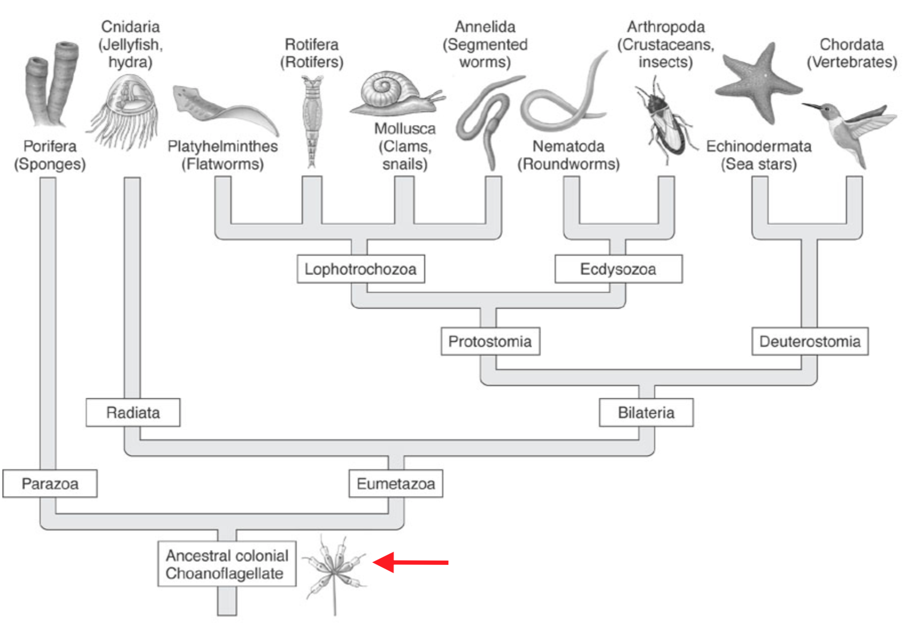 
  
 

| Change name | Characteristics | Example |
|:------------|:----------------|---------|
| Ancestral Colonial Choanoflagellates | <ul><li>They are either solitary or colonial.</li><li>They have flagella.</li><li>They are heterotroph, meaning they can't produce their own food.</li><li>They eat food by moving water towards them.</li></ul> |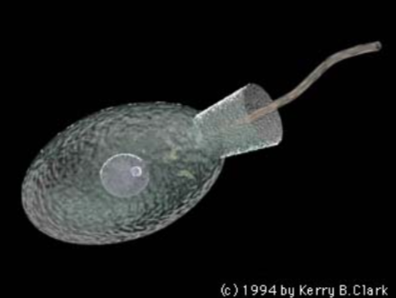 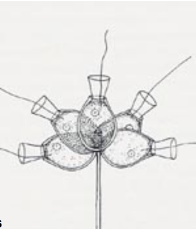 |
| Parazoa | __Songes__: <ul><li>Choanocytes (type of flagellated cells).</li><li>Marine (lives in the water).</li><li>They are asymetrical.</li><li>No true tissues.</li></ul> |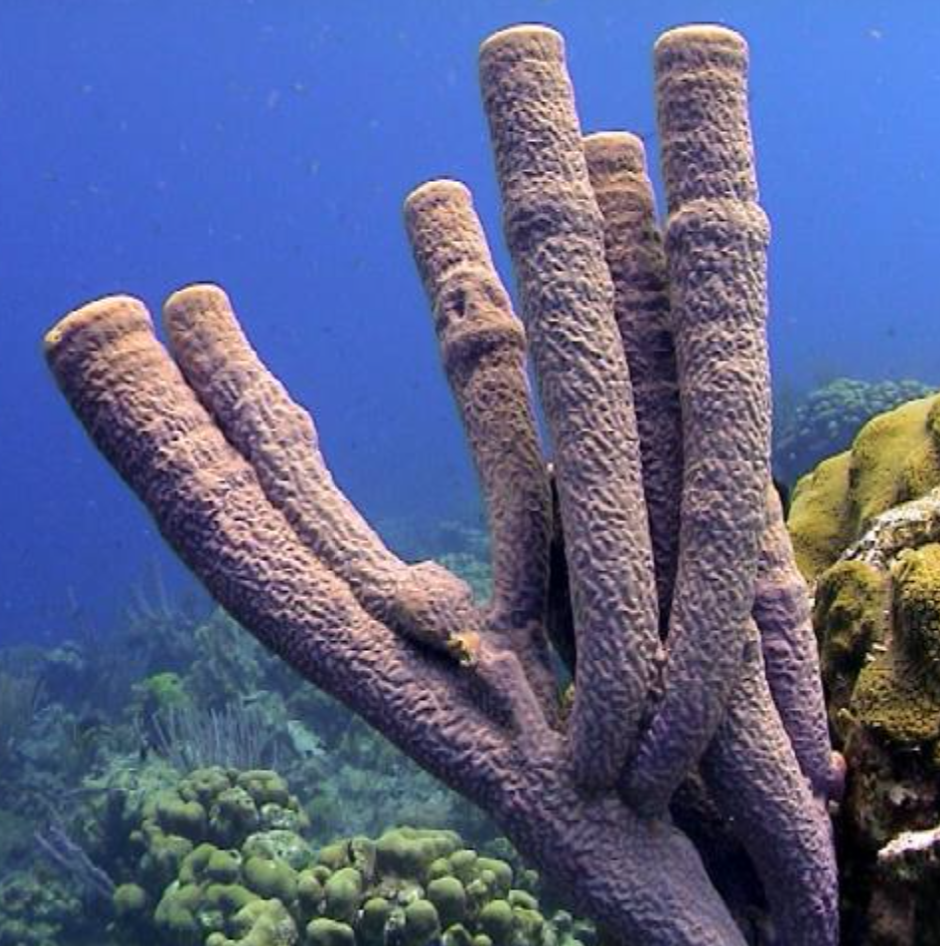 |
| Eumetazoa | <ul><li>They are symetrical.</li></ul> | 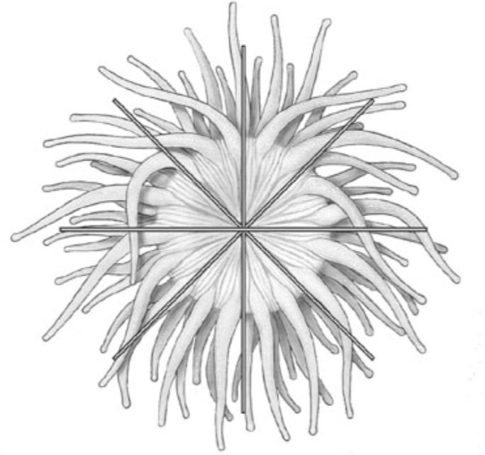 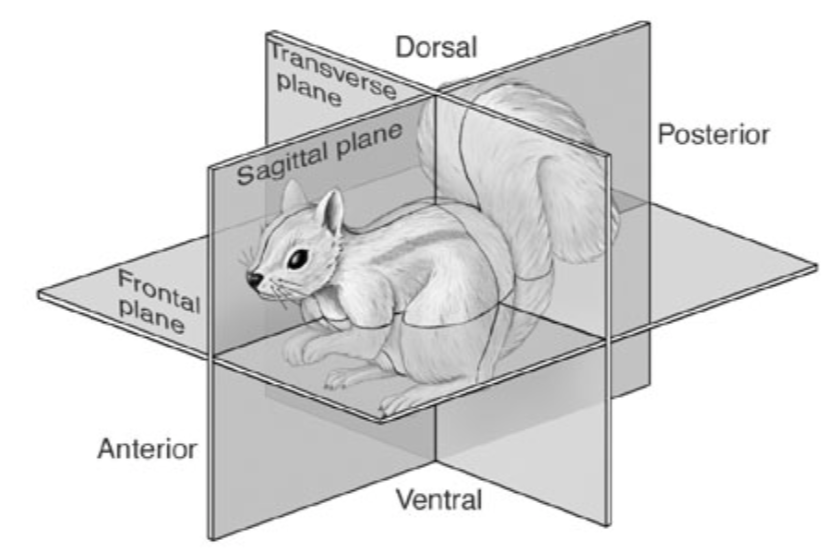 |
| Radiata | __Cnidarians__: <ul><li>Nematocyst (type of cells that makes the tentacles of a jelly fish).</li><li>Marine (lives in the water).</li><li>They are <b>radially symetrical</b>.</li><li>Only two layers of embryonic cells.</li></ul> |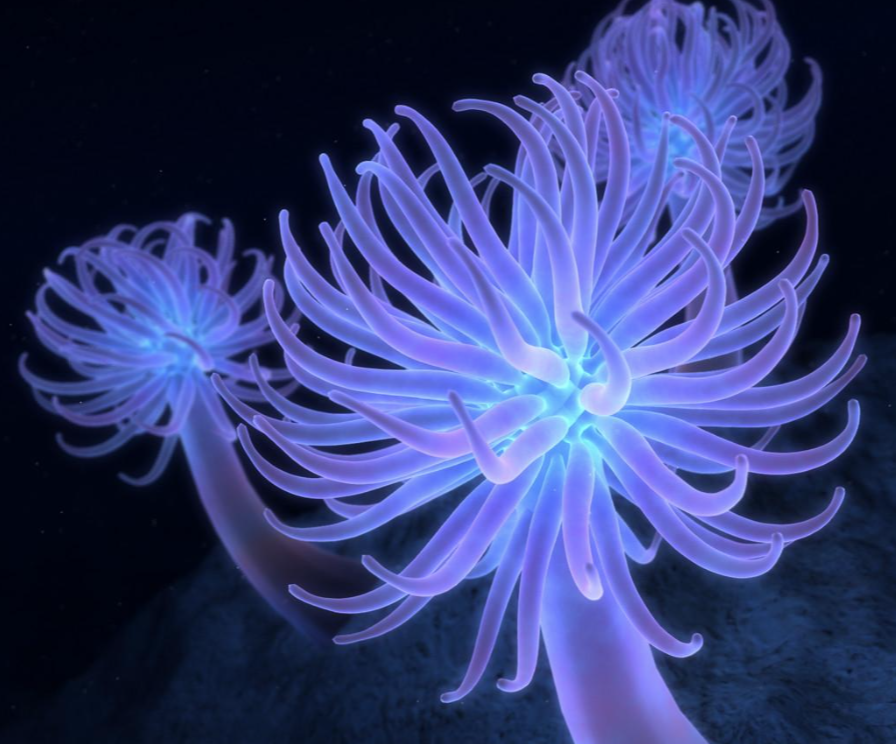 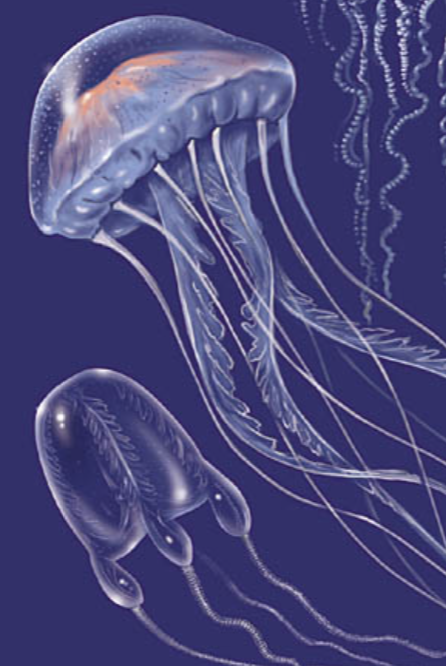 |
| Lophotrochzoa |<ul><li>Some examples are the floatworms, clams, snails, rotifers and segmented worms.</li><li>Marine (lives in the water).</li><li>They have <b>tentacules surrounding their mouths</b>.</li></ul> |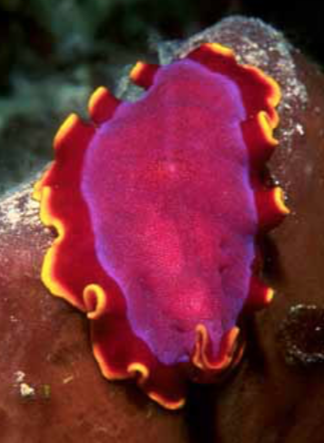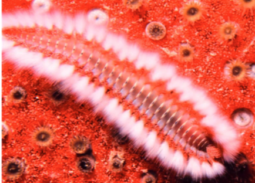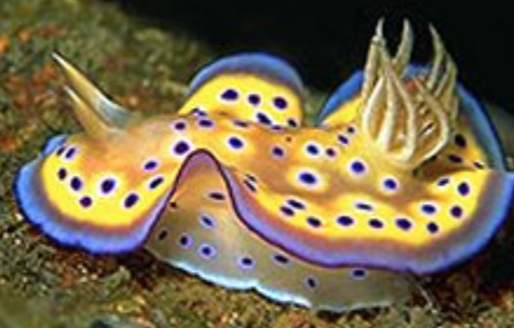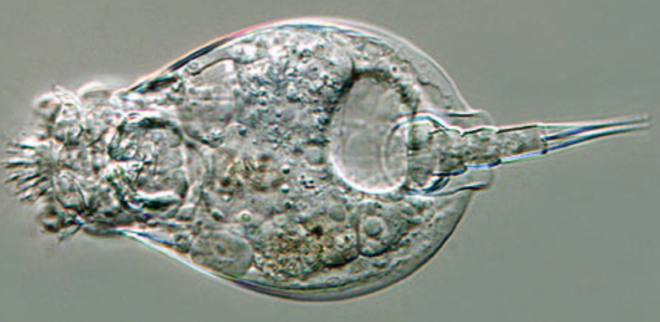 |
| Ecdysozoa |<ul><li>Some examples are the insects, crustaceans and round worms.</li></ul> |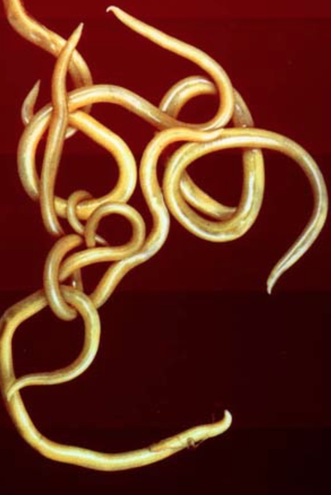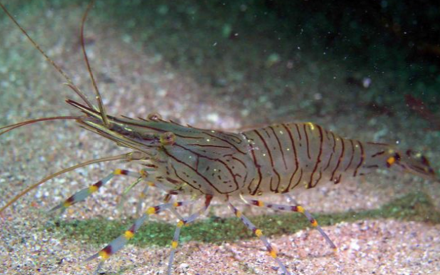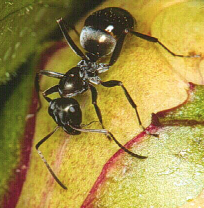 |
| Deuterostomia |<ul><li>Some examples are the Kangourous, whales, frogs.</li></ul> |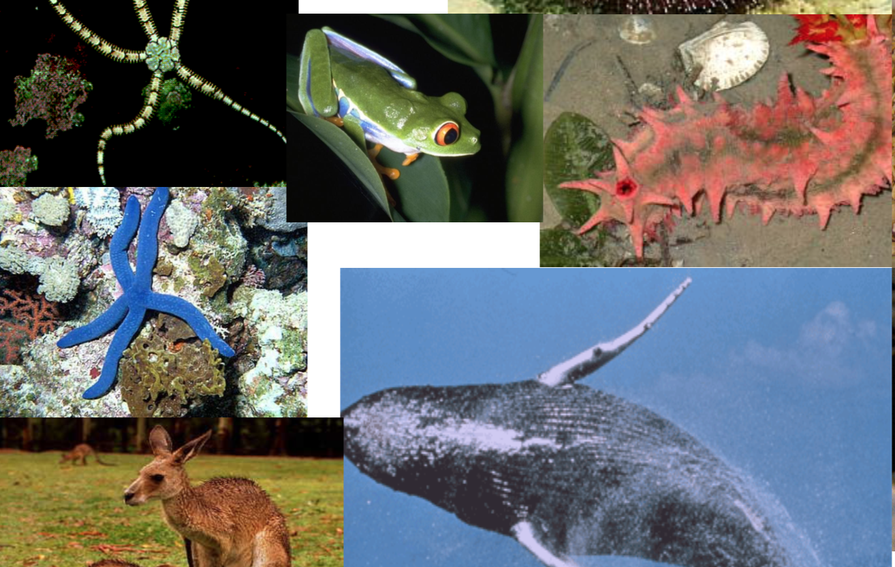 |
    

## Plants

## Fungi

