# Modern Diversity 2

## Some Facts

  > Between bacteria/archae, protist, fungi, plants and animals, the animals have the greatest number of species.
  
  > Between the mammals, the insects, the flatworms (platyhelminthes) and the mollusks (clams, snails) the insects have the greatest number of species (50%+).
  
  > Plants, animals and fungi are 3 kingdoms of the multicellular organisms.
  
  > Plants are known to evolve from organism similar to green algae. In fact, many plants reflect the transition from water to land.
  
  > Fungi are not simple plants, but a sister group of the animals.

## Animals
  
  > Hypotheized to evolve from the Choanoflagellates.
  
  > Animals obtain their energy from eating other organims
  
  > Cells that lack cell walls, and secrete an extracellular matrix consisting of collagen, integrins, glycoprotein and proteoglicans.
  
  > Here's the tree to learn by heart:
   

| Change name | Characteristics | Example |
|:------------|:----------------|---------|
| Ancestral Colonial Choanoflagellates | <ul><li>They are either solitary or colonial.</li><li>They have flagella.</li><li>They are heterotroph, meaning they can't produce their own food.</li><li>They eat food by moving water towards them.</li></ul> |  |
| Parazoa | __Songes__: <ul><li>Choanocytes (type of flagellated cells).</li><li>Marine (lives in the water).</li><li>They are asymetrical.</li><li>No true tissues.</li></ul> | |
| Eumetazoa | <ul><li>They are symetrical.</li></ul> |   |
| Radiata | __Cnidarians__: <ul><li>Nematocyst (type of cells that makes the tentacles of a jelly fish).</li><li>Marine (lives in the water).</li><li>They are <b>radially symetrical</b>.</li><li>Only two layers of embryonic cells.</li></ul> |  |
| Lophotrochzoa |<ul><li>Some examples are the floatworms, clams, snails, rotifers and segmented worms.</li><li>Marine (lives in the water).</li><li>They have <b>tentacules surrounding their mouths</b>.</li></ul> | |
| Ecdysozoa |<ul><li>Some examples are the insects, crustaceans and round worms.</li></ul> | |
| Deuterostomia |<ul><li>Some examples are the Kangourous, whales, frogs.</li></ul> | |

## Plants

  > They originate from green algae. They transitioned from water to land.
  
  > Plants are multicellular eukaryotes.
  
  > They use photons for energy. Therefore, ther are photoautotrophic.
  
  > The recent development of higher plants is a mistery.
  
  > Here are the 4 major evolutionary inventions in plants:
  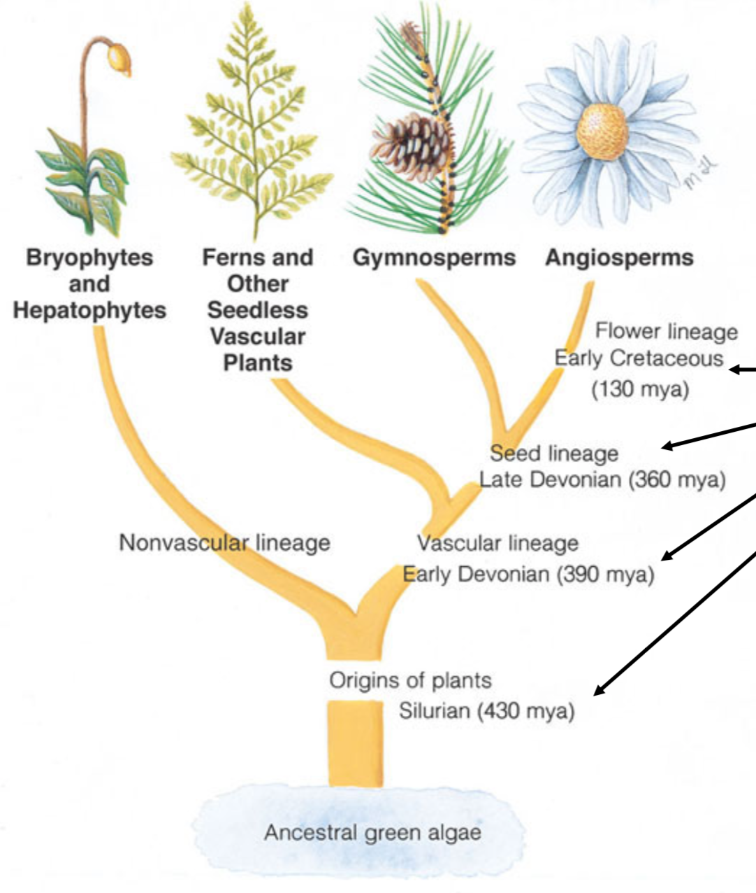
  
| Change name | Characteristics | Example |
|:------------|:----------------|---------|
| Bryophyte | 
<ul><li>Some of the earliest land plants.</li><li>The Bryophyte were important in two major transitions: (1) from water to land, (2) from haploid gamethophyte to diploid sporophyte.</li><li>They lack of vascular tissues and roots to transport water and nutriments.</li><li>Thrive in damp places, even if it can withstand drought.</li><li>They stay low (to the floor) because they lack lignan to strengten the cell walls.</li><li>They are simple. And limited to moist environment. </li><li>Some examples are mosses, liverworts, hornworts.</li></ul> | |
| Seedless Vascular Plants | <ul><li>Vascular refers to the presence of conductive tissues. There are 2 main types: (1) xylem which allow the water to be transported, and (2) phloem which allow the nutriments to be transported.</li><li>The major featuress is that they have vascular tissues. That allowed they to live in dryer environment. They love damp places but can sustain drought</li><li>Moving to land involved three major changes: (1) reduction of the gamete size, (2) easily dispersible pollen and (3) capsule for spores in seed.</li><li>The ferns evolved into 2 categories: (1) Gymnosperms and (2) Angiosperms.</li><li>They have well developed cuticule and stoma (pores in the leaf that allow gas to move around) which minimize the H2O loss and regulate gas exchange. </li><li>The ferns, horsetails and silurian (earliest fossil) are examples of Seedless Vascual plants.</li></ul> |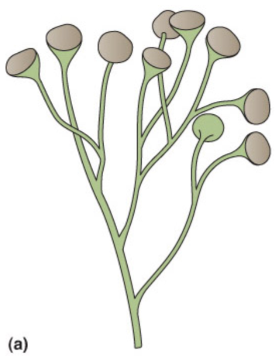 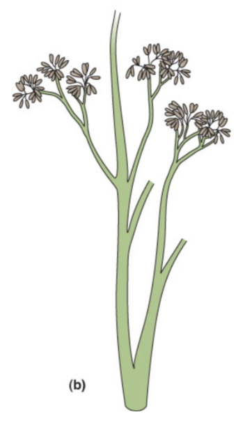 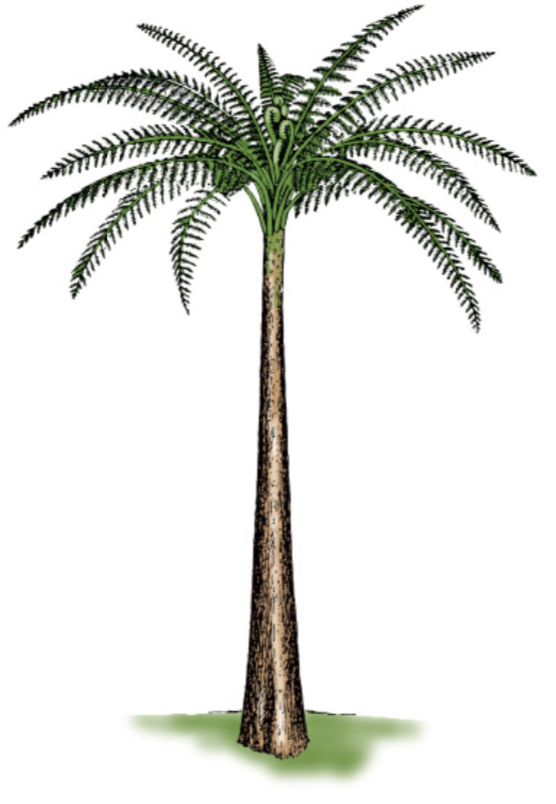 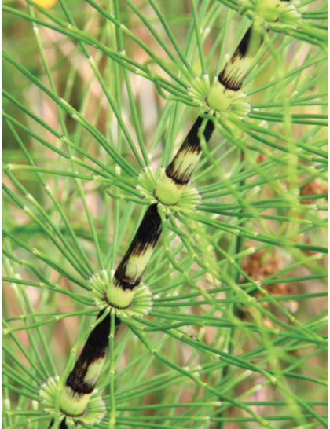|
| Gymnosperms | <ul><li>The seed is invented. It provides a small capsule that inclued the plant embryo, some nutriments and a coat to protect.</li><li>The pollen is ivented. The pollen is the plant's sperm. IT can now be transported by air, water and animals.</li><li>The most common Gymnosperms are conifers (cone-bearing trees). Some examples are the pine, the fur, redwood, spruce and cedar.</li></ul> |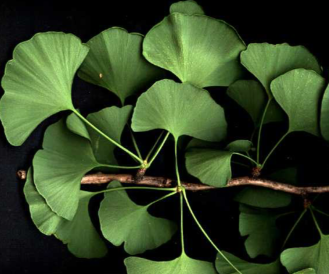 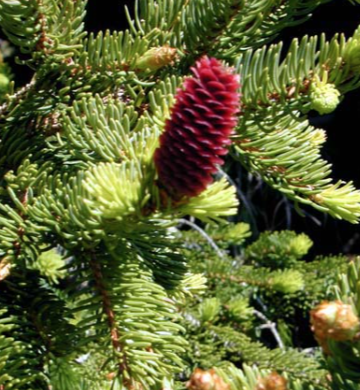 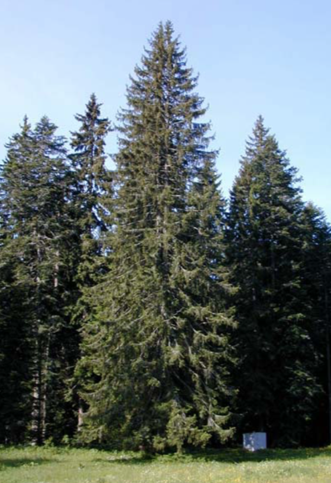 |
| Angiosperms | 
<ul><li>They advertise their sex organs for all to see (like a flower).</li>
    <li>95% of amodern plants are Angiosperms.</li>
    <li>The major invention is the flower.</li>
    <li>The Angiosperms have  complex cycle of life (see image beside).</li></ul> |
    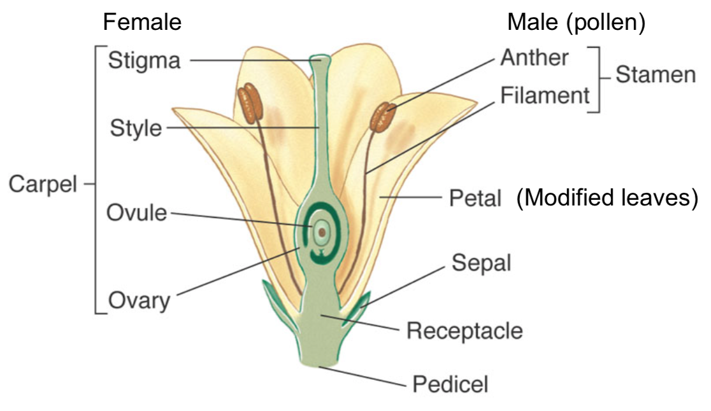 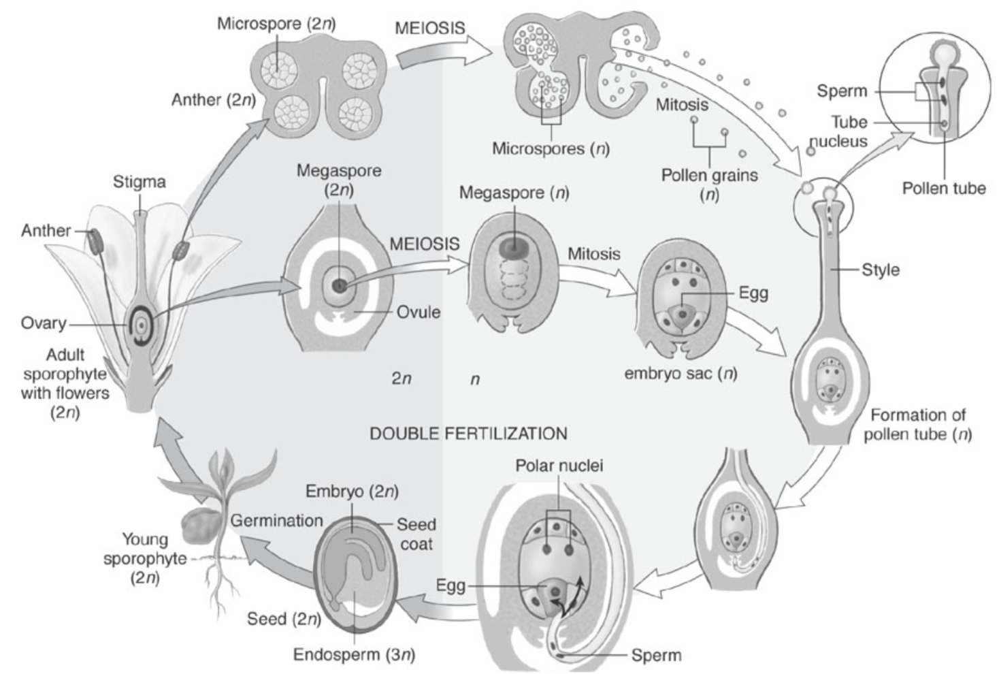 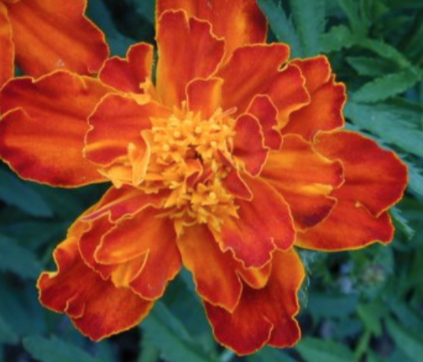 |
    
### Why are Angiosperms so Successful?

  > Because their evolution was rapid. 
  
  > The flower structure enable birds and insects to polinate them and disperse they sperms everywhere.

  
## Fungi

  > Fungi are not plants. They do not have chlorophyle nor photosynthesis. In fact, they are more closely related to animals than plants. Animals and  Fungi share the same choaflagellate ancestor.
  
  > The cell walls are made of chitin (fibruss substance).
  
  > Fungi absorbs nutriments from its surface (substrate).
  
  > They release digestive enzymes.
  
  > They are the primarily decomposer in the forest.
  
  > They appeard 440 m.y.a., at the same time vasicular plants appeard.
  
  > Here's the anatomy of a fungi:
  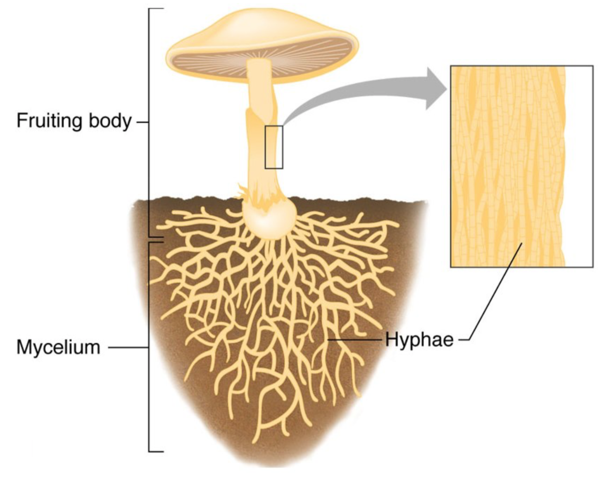
