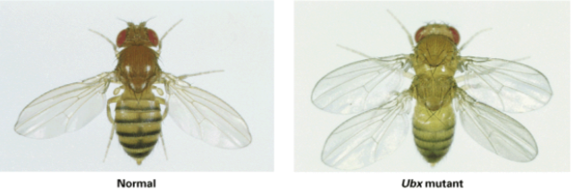
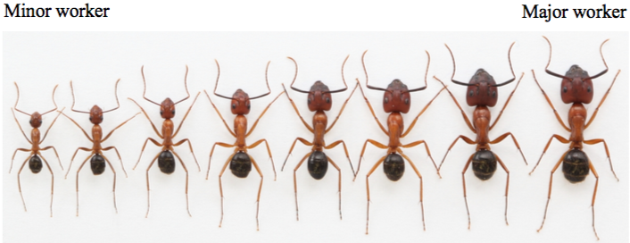

# Modern Diversity 2

##  Individual Genetic Variation and Gene Regulation

### Variation's Central Questions (p .212)

    1. What is the relationship between the genetic variation of the genotype (change in gene) and the variation of the phenotype (change in physic)?
    
    2. What are the mechanisms by which mutations and modifications of gene regulation serve as source of variation?
    
    3. What other sources of variation are available to population?
    
    4. What are the ecological and developmental determinants of phenotypic variation?

### Variation in Chromosome Number (p. 213)

  > There are 2 major type of changes: the number of entire sets of chromosomes and the numbers of single chromosomes within a set.
  
  > _Polyploidy_ describes a cell that has a repetitive double.
  
  > Here are example of structural chromosomal changes:                                          
   
  
### Mutations as a Source of Genetic Variation (p. 219)

  > There are 2 levels at which mutation are usually expressed: within a gene product (e.g. in the aminoacid constitution of a protein) or in the regulation of a gene (or its product).
  
  > Mutation may affect either the rate at which a gene product is produced or simply if it is produced or not.
  
  
### Gene Regulation (p. 222)

  > We observe different organism that share the same type of protein. This is caused by shared enzymes involved in basic biochemicalprocesses.

  > Gene regulation consist of 3 processes: (1) which genes are transcribed into messenger RNA, (2) which transcript are translated into proteins, (3) which proteins are activated.
  
  > These 3 processes often begins with signals.
  
#### Genere regulation within the Eukariotic cell (p. 225 and 231)

  > There are 3 regulatory mechanisms that control transcription of DNA tp mRNA: (1) cis-, (2) trans- and RNAi-regulation.
  
  > There is a fourth regulatory mechanisms called transposon. Transposons produce special transposase enzymes that allow it to insert copies of itself into various target sites in an organism's nuclear genome. Here's an image for visualization:
   

  > Eukaryotic genes also are regulates after mRNA has been produced by __post-transcriptional modification__. This is when proteins occur through different splicing patternsthat remove amino acid sequences, or by chemically odifying amino acid residues.

#### Hox Genes

  > Hox genes are regulatory genes that act during to impart identity to regions along the body axis.
  
  > They determine during development three things: (1) Where paired wings form, (2) where lagsdevelop, (3) How flower parts are arranged.
  
  > The Hox Genes are conserved accross the animal kindom. Here's an image to prove it: 
  
  
#### Homeotic Mutation

  > This type of transformation modifies the identity of one body part into another. Here's an example:
  
  

## Phenotypic Variation

### Phenotypic Variation due to Environment

  > Epigenetic can mediate gene-by-environment. For instance, DNA Methyltransferases is the process ofadding a H3C group to the gene transcription, which can be inherited. Here are images that proves the point:
  
| (A) | (B) |
|-----|-----|
|  |  |

  > We can observe species of butterflies that changes colors depending on seasons.

# *__I am at slide #48

